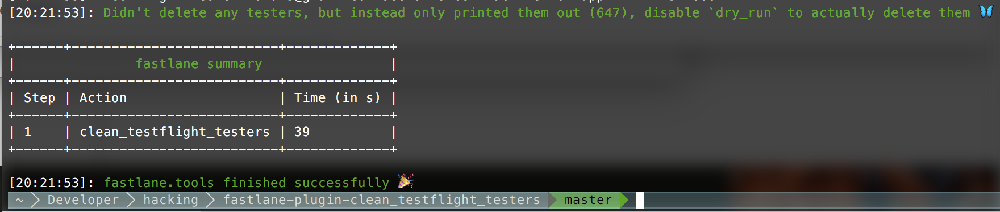

# clean_testflight_testers plugin

[](https://rubygems.org/gems/fastlane-plugin-clean_testflight_testers)

## Getting Started

This project is a [_fastlane_](https://github.com/fastlane/fastlane) plugin. To get started with `fastlane-plugin-clean_testflight_testers`, add it to your project by running:

```bash
fastlane add_plugin clean_testflight_testers
```

## About clean_testflight_testers

#### Note: This plugin isn't available to use yet

Please wait until https://github.com/fastlane/fastlane/pull/10186 is merged and shipped, which should be in a few days or so.



Automatically remove TestFlight testers that are not actually testing your app

Just add the following to your Fastfile

```ruby
lane :clean do
  clean_testflight_testers
end

# or

lane :clean do
  clean_testflight_testers(dry_run: true) # this won't delete out inactive testers, but just print them
end

# or

lane :clean do
  clean_testflight_testers(username: "apple@krausefx.com", app_identifier: "best.lane"")
end
```

## Issues and Feedback

Make sure to update to the latest _fastlane_.

For any other issues and feedback about this plugin, please submit it to this repository.

## Troubleshooting

If you have trouble using plugins, check out the [Plugins Troubleshooting](https://docs.fastlane.tools/plugins/plugins-troubleshooting/) guide.

## Using _fastlane_ Plugins

For more information about how the `fastlane` plugin system works, check out the [Plugins documentation](https://docs.fastlane.tools/plugins/create-plugin/).

## About _fastlane_

_fastlane_ is the easiest way to automate beta deployments and releases for your iOS and Android apps. To learn more, check out [fastlane.tools](https://fastlane.tools).
